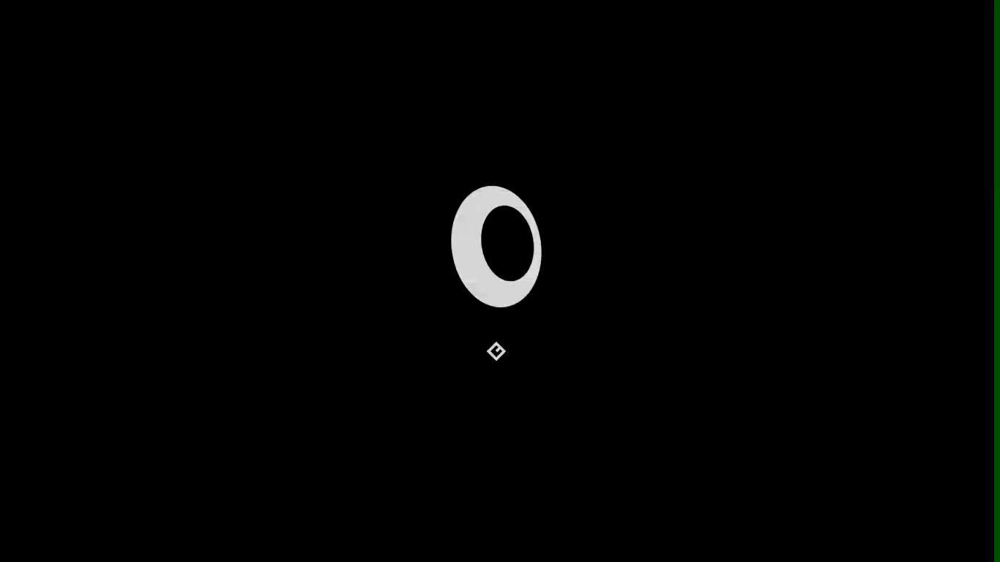
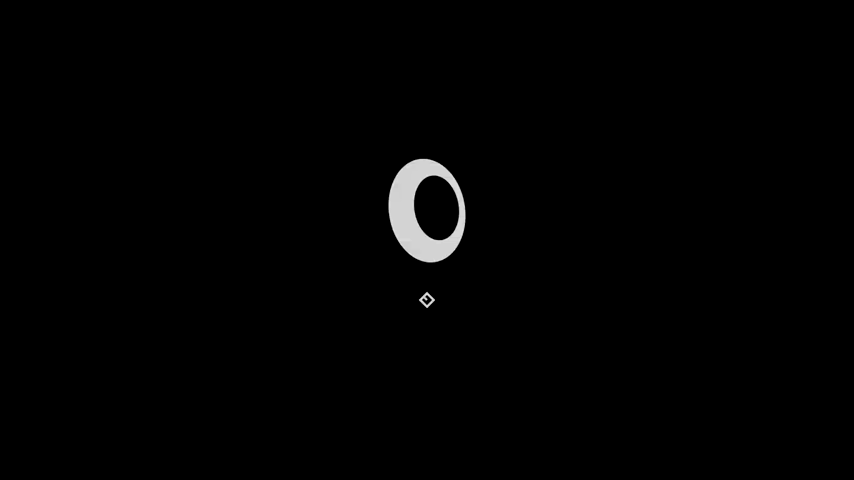

<div align="center">
  
  <h1>Nula Plymouth Theme</h1>
  <p>A minimalist Plymouth boot splash theme featuring a sleek loading animation and modern dark aesthetic.</p>
</div>

<p align="center">
  <a href="#installation"></a>
  <a href="LICENSE"></a>
  <a href="https://github.com/l7p3x/Nula-Plymouth-Theme/stargazers"></a>
</p>

---

## Overview

**Nula Plymouth Theme** is a modern, minimalist Plymouth theme designed to make your system startup process smooth and visually pleasing. Taking inspiration from clean design principles, it emphasizes clarity and simplicity during the boot process.

It features multi-resolution support, a sleek dark interface, fluid loading animations, and seamless password prompt integration (e.g., for LUKS/disk encryption).

## Features

- **Multi-Resolution Support**: Includes graphical assets for screens ranging from `1024x576` all the way up to 4K (`3840x2160`).
- **Smooth Loading Animation**: A clean and fluid loading circle sequence during boot.
- **Password Prompt Ready**: Fully customized UI for disk decryption (`lock.png`, `entry.png`, `box.png`).
- **Minimalist Aesthetic**: Dark, modern, and distraction-free startup experience.

### Boot Screen Preview

<div align="center">
  
</div>

## Installation

### 1. Clone the Repository

```bash
git clone https://github.com/l7p3x/Nula-Plymouth-Theme.git
cd Nula-Plymouth-Theme
```

### 2. Install the Theme

Copy the theme directory to your system's Plymouth themes folder:

```bash
sudo cp -r . /usr/share/plymouth/themes/nula-boot
```

### 3. Configure Plymouth

**For Debian/Ubuntu-based systems:**

Install the theme into the alternatives system and configure it as default:

```bash
sudo update-alternatives --install /usr/share/plymouth/themes/default.plymouth default.plymouth /usr/share/plymouth/themes/nula-boot/nula-boot.plymouth 100
sudo update-alternatives --config default.plymouth
```

> Select `nula-boot` from the list when prompted.

Update your initramfs to apply the changes to the boot image:

```bash
sudo update-initramfs -u
```

**For Arch Linux:**

Edit your `/etc/plymouth/plymouthd.conf` to use the theme:

```ini
[Daemon]
Theme=nula-boot
```

Then, rebuild your initcpio:

```bash
sudo mkinitcpio -P
```

## Directory Structure

```text
nula-boot/
├── gfx/                # Resolution-specific assets (loading circles, logos)
├── box.png             # Password prompt asset
├── bullet.png          # Password input masked character
├── entry.png           # Password input field
├── lock.png            # Encryption lock icon
├── nula-boot.plymouth  # Main Plymouth configuration file
└── nula-boot.script    # Plymouth animation script logic
```

## Dependencies

- **Plymouth**: The standard Linux boot splash framework.

## Uninstallation

To remove the theme, delete the theme folder:

```bash
sudo rm -rf /usr/share/plymouth/themes/nula-boot
```

Then, set your default theme back to a previous one and rebuild your boot image.

**For Debian/Ubuntu-based systems:**

```bash
sudo update-alternatives --config default.plymouth
sudo update-initramfs -u
```

**For Arch Linux:**

```bash
# Edit /etc/plymouth/plymouthd.conf and set Theme= to your preferred theme
sudo mkinitcpio -P
```

## License

This project is licensed under the BSD 3-Clause License — see the [LICENSE](LICENSE) file for details.

## Credits

- **Developer:** Created by [l7p3x](https://github.com/l7p3x).
- **Based on:** [Unicyclesynced Ani-10 Dark Gray Plymouth Theme](https://www.gnome-look.org/p/1444644) by **Markospoko**.
